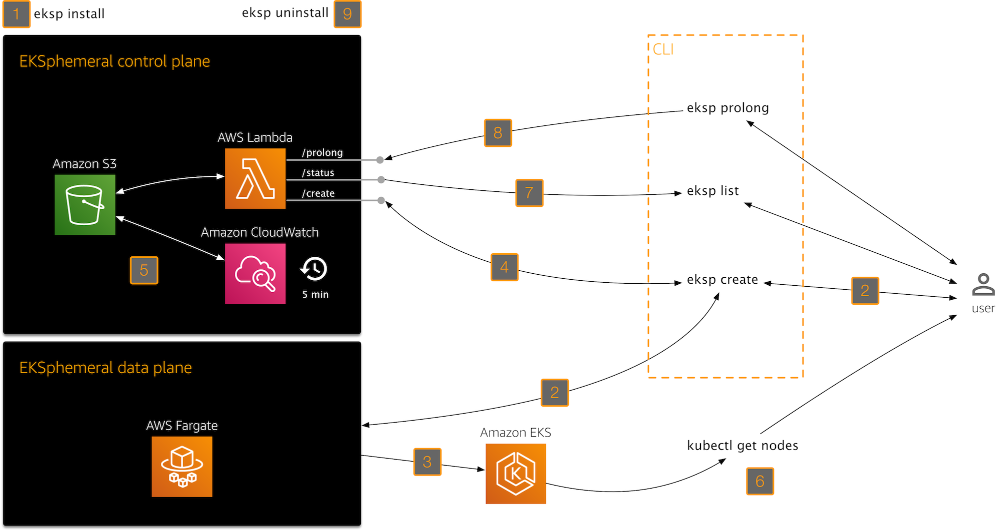

# EKSphemeral: The EKS Ephemeral Cluster Manager

> Do not use in production. This is a service for development and test environments. 

A simple Amazon EKS manager for ephemeral dev/test clusters, allowing you to launch an EKS cluster with an automatic tear-down after a given time.

EKSphemeral uses, in a nutshell, a AWS Lambda/Amazon S3 combo (as the control plane) and AWS Fargate (as the data plane):



In order to use EKSphemeral, clone this repo, and make sure you've got `jq`, the `aws` CLI and the [Fargate CLI](https://somanymachines.com/fargate/) installed.

If you like, you can have a look at a [4 min video walk through](https://www.youtube.com/watch?v=2A8olhYL9iI), before you try it out yourself.

## Preparation

Create an S3 bucket `eks-svc` for the Lambda functions like so:

```sh
$ aws s3api create-bucket \
      --bucket eks-svc \
      --create-bucket-configuration LocationConstraint=us-east-2 \
      --region us-east-2
```

Create an S3 bucket `eks-cluster-meta` for the cluster metadata like so:

```sh
$ aws s3api create-bucket \
      --bucket eks-cluster-meta \
      --create-bucket-configuration LocationConstraint=us-east-2 \
      --region us-east-2
```

## Usage

The following assumes that the S3 bucket as outlined above is set up and you have access to AWS configured, locally.

```sh
$ ./eksp-up.sh
```

First, let's check what clusters are already managed by EKSphemeral:

```sh
$ ./eksp-list.sh
["9be65bee-3baa-4fd0-aa3e-032325d5390c","dd72f73a-3457-4d4b-b997-08a2b376160b"]
```

Here, we get an array of cluster IDs back. We can use such an ID as follows to look up the spec of a particular cluster:

```sh
$ ./eksp-list.sh dd72f73a-3457-4d4b-b997-08a2b376160b | jq
{
  "name": "default-eksp",
  "numworkers": 1,
  "kubeversion": "1.12",
  "timeout": 20,
  "owner": "nobody@example.com"
}
```

Now, let's create a throwaway cluster named `2node-111-30`, using the `EKSPHEMERAL_SG` security group, with two worker nodes, using Kubernetes version 1.11, with a 30 min timeout as defined in the example cluster spec file [2node-111-30.json](svc/2node-111-30.json):

```sh
$ cat svc/2node-111-30.json
{
    "name": "2node-111-30",
    "numworkers": 2,
    "kubeversion": "1.11",
    "timeout": 30,
    "owner": "hausenbl+notif@amazon.com"
}

$ ./eksp-create.sh 2node-111-30.json $EKSPHEMERAL_SG
```

Note that both the security group and the cluster spec file are optional. If not present, the first security group of the default VPC and `default-cc.json` will be used.

## Tear down

To tear down EKSphemeral, use the following command which will remove control plane elements (Lambda functions, S3 bucket content):

```bash
$ ./eksp-down.sh
```

## Development

See the dedicated [development docs](dev.md) for how to customize and extend EKSphemeral.