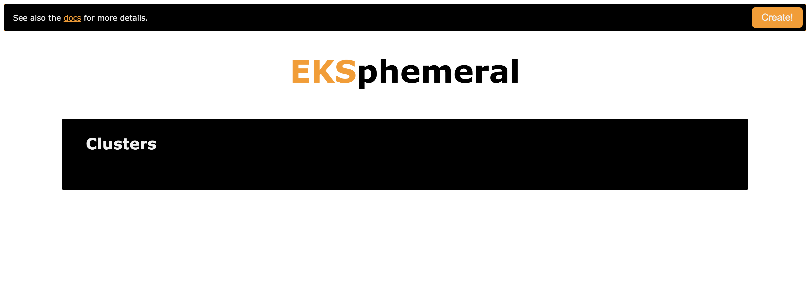

# EKSphemeral Web UI

In order to use the web UI locally, you need to have Docker installed.
The container image will be built with the connection settings for your
EKSphemeral deployment.

So, first make sure to have `EKSPHEMERAL_URL` set:

```sh
$ export EKSPHEMERAL_URL=$(aws cloudformation describe-stacks --stack-name eksp | jq '.Stacks[].Outputs[] | select(.OutputKey=="EKSphemeralAPIEndpoint").OutputValue' -r)
```

Now you can build the UI container image like so (ensure you're in the `ui/` directory):

```sh
$ make build
...
```

Verify that the image has been built and is available, locally:

```sh
$ make verify
REPOSITORY                    TAG                 IMAGE ID            CREATED             SIZE
quay.io/mhausenblas/eksp-ui   0.1                 e763c3064ea0        3 hours ago         174MB
```

Now you can launch it:

```sh
$ make run
...
```

Head over to http://localhost:8080 and you should see something like the following.

First, on start up:



When you create a new cluster:


When you want to configure your local environment to use the cluster:


When you want to prolong the life time of a cluster:


